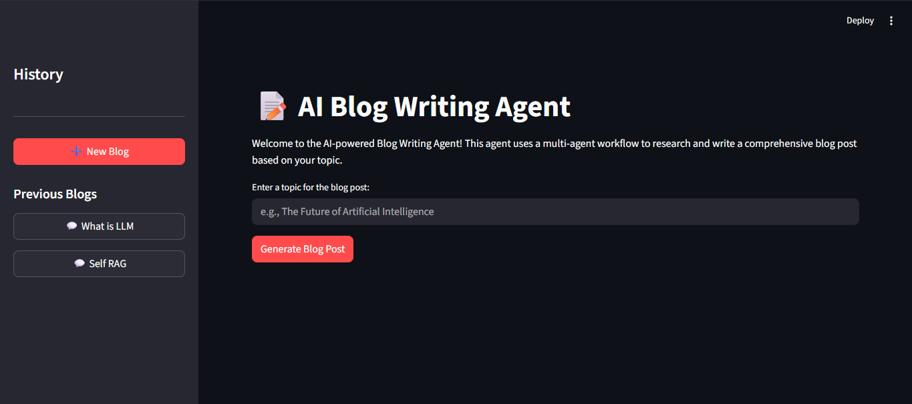
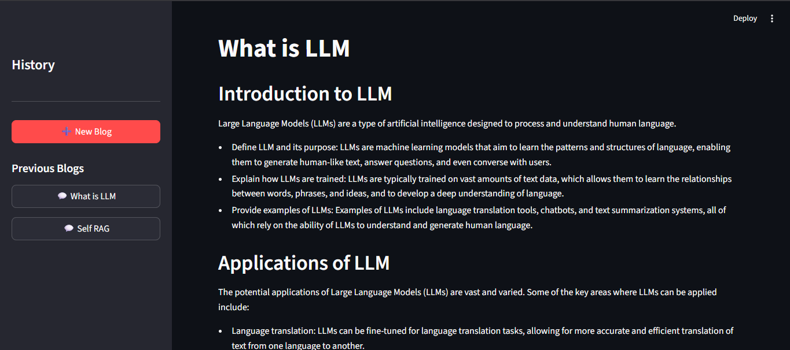
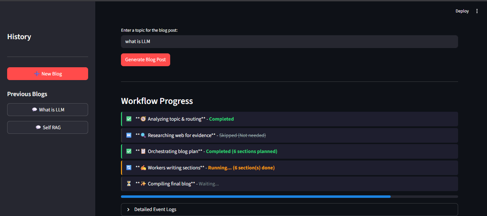
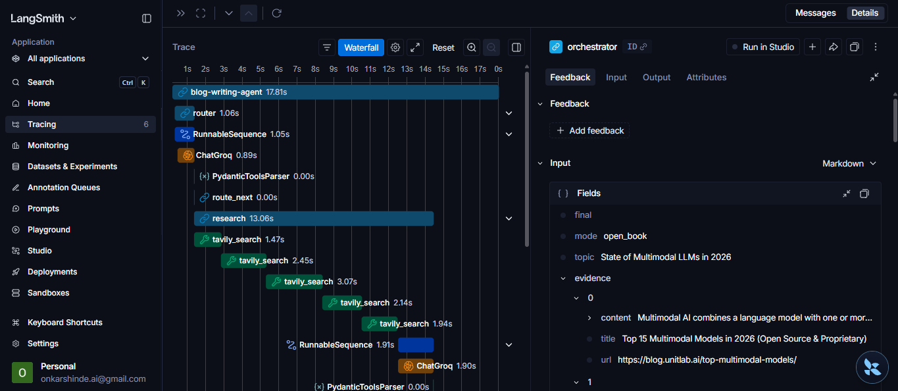

# 📝 AI Blog Writing Agent

> An autonomous, multi-agent system that researches the web and writes comprehensive, structured blog posts — powered by **LangGraph**, **Groq (LLaMA 3)**, and **Tavily Search**.


---

## 🧠 What is this Project?

The **AI Blog Writing Agent** is a fully autonomous agentic pipeline that takes a single topic as input and produces a fully-written, well-structured, research-backed blog post — automatically.

Unlike a simple prompt-to-text setup, this system uses a **graph-based multi-agent workflow** (powered by LangGraph) where specialized agents collaborate:

1. **Router** — Decides whether the topic needs live web research or can be answered from the LLM's internal knowledge.
2. **Researcher** — If needed, searches the web in real time using Tavily Search and gathers evidence.
3. **Orchestrator** — Plans the complete blog structure (title, sections, tone, audience, word count targets).
4. **Workers** — Multiple parallel worker agents each write one section of the blog simultaneously (fan-out pattern).
5. **Reducer** — Collects all sections and stitches them together into the final polished blog post.

The result is a **production-quality blog post** saved to your screen with a one-click Markdown download option. All past blogs are instantly accessible in a **ChatGPT-style sidebar history** — every generation is stored independently so there's no context bleed between posts.

---

## 📸 Screenshots

### Streamlit Web Interface
<div align="center">
  
</div>
<br>
<div align="center">
  
</div>
<br>
<div align="center">
  
</div>

---

## ✨ Features

- 🔀 **Intelligent Routing** — Automatically detects if the topic needs fresh web research or not
- 🌐 **Live Web Research** — Uses Tavily Search API to gather real-time evidence
- 📋 **Structured Blog Planning** — Creates detailed section outlines with goals, bullets, and word count targets
- ⚡ **Parallel Section Writing** — Worker agents write all sections simultaneously using LangGraph's fan-out pattern
- 🕗 **Chat History Sidebar** — Browse all previously generated blogs in a clean sidebar (like ChatGPT)
- 💾 **Persistent Checkpoints** — Uses SQLite-backed LangGraph checkpointing so history survives restarts
- ⬇️ **Markdown Download** — One-click download of any generated blog as a `.md` file
- 🔄 **Real-time Progress UI** — Live workflow progress indicators with node-by-node status updates

---

## 🛠️ Tech Stack & Tools Used

| Tool / Library | Purpose |
|---|---|
| [LangGraph](https://langchain-ai.github.io/langgraph/) | Multi-agent stateful workflow orchestration |
| [LangChain](https://www.langchain.com/) | LLM abstraction, message handling |
| [Groq + LLaMA 3](https://console.groq.com/) | Ultra-fast LLM inference (llama-3.1-8b) |
| [Tavily Search](https://tavily.com/) | Real-time web search for research |
| [Streamlit](https://streamlit.io/) | Interactive web UI |
| [Pydantic v2](https://docs.pydantic.dev/) | Structured data validation for agent state |
| [LangSmith](https://smith.langchain.com/) | Complete agent observability and execution tracing |
| [langgraph-checkpoint-sqlite](https://pypi.org/project/langgraph-checkpoint-sqlite/) | Persistent state storage via SQLite |
| [Python Dotenv](https://pypi.org/project/python-dotenv/) | Secure API key management |

---

## 🏗️ Architecture Overview

```
START
  │
  ▼
┌─────────┐
│  Router │  ← Decides: research needed? (yes/no)
└─────────┘
  │         \
  ▼           ▼ (if no research)
┌──────────┐   │
│ Research │   │  ← Tavily web search
└──────────┘   │
  │             │
  └──────┬──────┘
         ▼
  ┌─────────────┐
  │ Orchestrator│  ← Plans blog sections
  └─────────────┘
         │
    (fan-out to N parallel workers)
         │
  ┌──────┴──────┐
  ▼   ▼   ▼   ▼
[W1][W2][W3][W4]   ← Workers (each writes one section)
  └──────┬──────┘
         ▼
  ┌─────────┐
  │ Reducer │  ← Merges all sections into final blog
  └─────────┘
         │
        END
```

### 🔍 LangSmith Tracing
The entire multi-agent state graph is fully observable with LangSmith. Here is how an execution trace looks under the hood:
<div align="center">
  
</div>

---

## 🚀 Setup & Installation

### Prerequisites
- Python 3.10+
- A virtual environment tool (`venv`)

### 1. Clone the Repository

```bash
git clone https://github.com/onkarshinde77/blog-writing-agent.git
cd blog-writing-agent
```

### 2. Create & Activate Virtual Environment

```bash
python -m venv .venv

# Windows
.venv\Scripts\activate

# macOS/Linux
source .venv/bin/activate
```

### 3. Install Dependencies

```bash
pip install -r requirements.txt
pip install langgraph-checkpoint-sqlite
```

### 4. Get Your API Keys

You need **two** API keys:

#### 🔑 Groq API Key (for LLaMA 3 LLM)
1. Go to [https://console.groq.com/](https://console.groq.com/)
2. Sign up / log in
3. Navigate to **API Keys** → **Create API Key**
4. Copy the key

#### 🔑 Tavily API Key (for Web Search)
1. Go to [https://app.tavily.com/](https://app.tavily.com/)
2. Sign up / log in
3. Your API key is shown on the dashboard
4. Copy the key

### 5. Configure Environment Variables

Create a `.env` file in the project root:

```env
GROQ_API_KEY=your_groq_api_key_here
TAVILY_API_KEY=your_tavily_api_key_here
```

### 6. Run the Application

```bash
python -m streamlit run main.py
```

Visit [http://localhost:8501](http://localhost:8501) in your browser.

---

## 🎮 How to Use

1. **Start the app** using the command above
2. **Type a topic** in the text input (e.g. *"The Future of Quantum Computing"*)
3. **Click "Generate Blog Post"** and watch the multi-agent workflow execute in real time
4. **Read or download** your generated blog post in Markdown format
5. **Browse history** — All past blogs appear in the left sidebar; click any title to re-read it

---

## 📁 Project Structure

```
blog-writing-agent/
├── main.py                  # Streamlit UI + entry point
├── requirements.txt
├── .env                     # API keys (not committed)
├── checkpoints.db           # SQLite history (auto-created)
└── src/
    ├── config.py            # LLM model + workflow config
    ├── graph/
    │   └── workflow.py      # LangGraph graph assembly & compilation
    ├── nodes/
    │   ├── router.py        # Routing logic
    │   ├── research.py      # Web research node
    │   ├── orchestrator.py  # Blog planning node
    │   ├── workers.py       # Section writing workers (parallel)
    │   └── reducer.py       # Final blog compilation
    ├── schemas/             # Pydantic models (State, Plan, Task, etc.)
    ├── prompts/             # LLM system prompts
    ├── tools/               # Tavily search wrapper
    └── utils/               # Helper utilities
```

---

## 🎓 What I Learned Building This

This project was an incredible deep dive into modern agentic AI systems. Here are the core concepts I explored:

- **Workflow of Agentic AI** — Moving beyond linear prompts into robust, stateful node-based pipelines.
- **Building Agents with LangGraph** — Defining nodes, edges, state schemas, and conditional routing in a `StateGraph`.
- **Parallel Execution / Fan-out Pattern** — Using `Send` to dynamically dispatch work to parallel worker agents simultaneously.
- **Orchestrator Pattern** — Having a "manager" agent plan the execution and dynamically generate steps for worker agents.
- **Tool Calling (Tavily)** — Connecting LLMs to live external APIs to retrieve context dynamically.
- **Core LangChain Concepts** — Constructing robust messages, chat abstractions, and environment configurations.
- **LangGraph Checkpointing** — Preserving full persistent history into a SQLite database, allowing users to scroll through past blogs seamlessly.
- **LangSmith Tracing** — Implementing full LLM observability to study rate limits, execution speeds, and inner-thought prompts.
- **Advanced Prompt Engineering** — Crafting precise system prompts that yield structured, reliable programmatic output using Pydantic schemas.

---

## 🔗 Useful Reference Links

- 📖 [LangGraph Documentation](https://langchain-ai.github.io/langgraph/)
- 📖 [LangGraph Checkpointing Guide](https://langchain-ai.github.io/langgraph/concepts/persistence/)
- 📖 [Groq Console & Models](https://console.groq.com/docs/models)
- 📖 [Tavily Search API](https://docs.tavily.com/)
- 📖 [LangSmith Tracing](https://smith.langchain.com/)
- 📖 [Streamlit Documentation](https://docs.streamlit.io/)

---

## 🤝 Connect With Me

If you found this project useful or have questions, feel free to connect!

- 🐦 **Twitter/X**: [@onkarshinde77](https://twitter.com/onkarshinde77)
- 💼 **LinkedIn**: [linkedin.com/in/onkarshinde77](https://linkedin.com/in/onkarshinde77)
- 🐙 **GitHub**: [github.com/onkarshinde77](https://github.com/onkarshinde77)

---

## 📄 License

This project is open-source under the [MIT License](LICENSE).

---

> Built with ❤️ by **Onkar Shinde** — exploring the frontier of autonomous AI agents.
