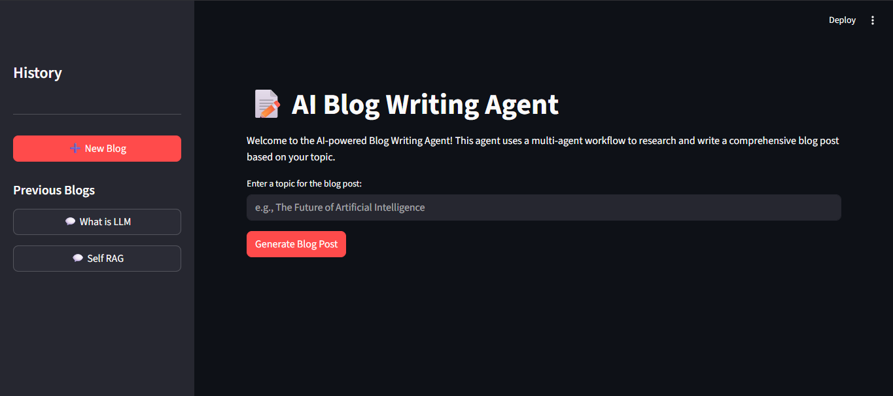
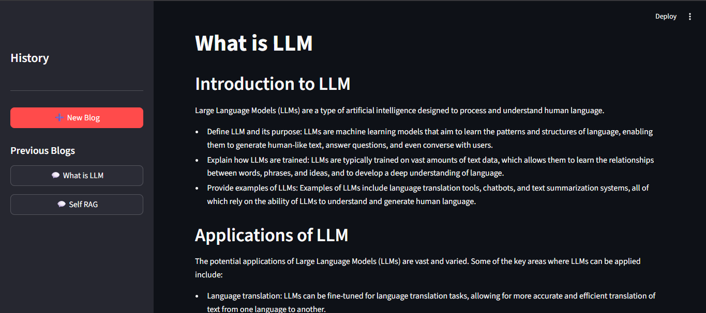
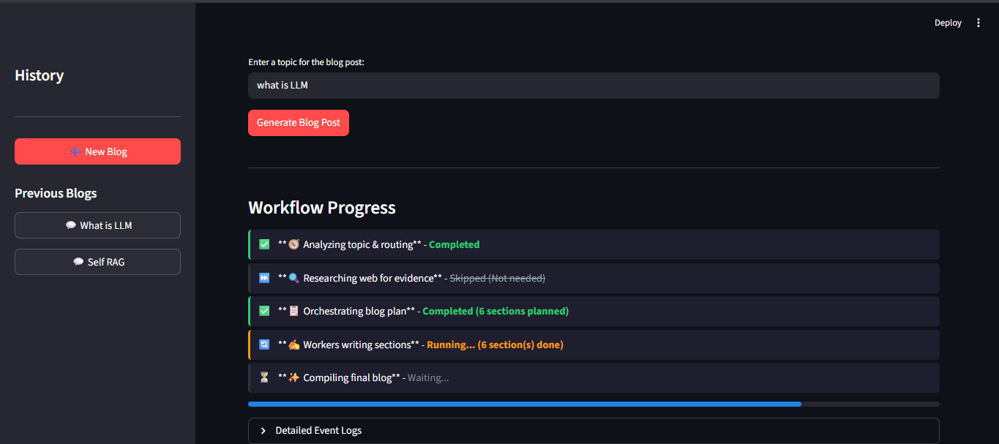
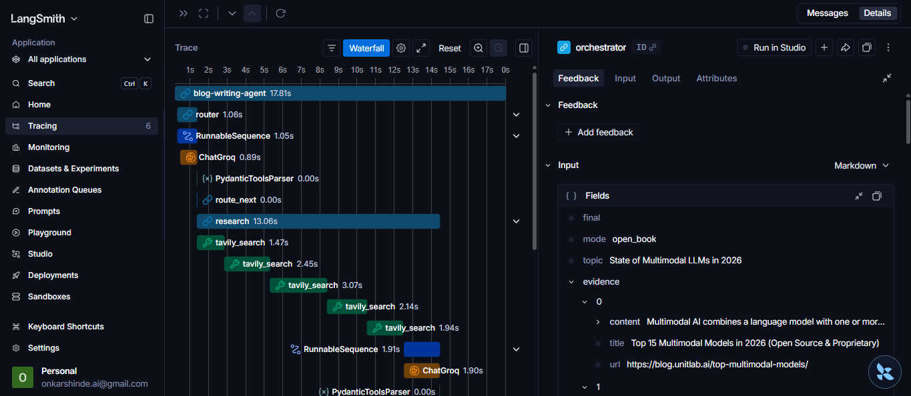

# 📝 AI Blog Writing Agent

> An autonomous, multi-agent system that researches the web and writes comprehensive, structured blog posts — powered by **LangGraph**, **Groq (LLaMA 3)**, and **Tavily Search**.


---

## 🧠 What is this Project?

The **AI Blog Writing Agent** is a fully autonomous agentic pipeline that takes a single topic as input and produces a fully-written, well-structured, research-backed blog post — automatically.

Unlike a simple prompt-to-text setup, this system uses a **graph-based multi-agent workflow** (powered by LangGraph) where specialized agents collaborate:

1. **Router** — Decides whether the topic needs live web research or can be answered from the LLM's internal knowledge.
2. **Researcher** — If needed, searches the web in real time using Tavily Search and gathers evidence.
3. **Orchestrator** — Plans the complete blog structure (title, sections, tone, audience, word count targets).
4. **Workers** — Multiple parallel worker agents each write one section of the blog simultaneously (fan-out pattern).
5. **Reducer** — Collects all sections and stitches them together into the final polished blog post.

The result is a **production-quality blog post** saved to your screen with a one-click Markdown download option. All past blogs are instantly accessible in a **ChatGPT-style sidebar history** — every generation is stored independently so there's no context bleed between posts.

---

## 📸 Screenshots

### Streamlit Web Interface
<div align="center">
  
</div>
<br>
<div align="center">
  
</div>
<br>
<div align="center">
  
</div>

---

## ✨ Features

- 🔀 **Intelligent Routing** — Automatically detects if the topic needs fresh web research or not
- 🌐 **Live Web Research** — Uses Tavily Search API to gather real-time evidence
- 📋 **Structured Blog Planning** — Creates detailed section outlines with goals, bullets, and word count targets
- ⚡ **Parallel Section Writing** — Worker agents write all sections simultaneously using LangGraph's fan-out pattern
- 🕗 **Chat History Sidebar** — Browse all previously generated blogs in a clean sidebar (like ChatGPT)
- 💾 **Persistent Checkpoints** — Uses SQLite-backed LangGraph checkpointing so history survives restarts
- ⬇️ **Markdown Download** — One-click download of any generated blog as a `.md` file
- 🔄 **Real-time Progress UI** — Live workflow progress indicators with node-by-node status updates

---

## 🛠️ Tech Stack & Tools Used

| Tool / Library | Purpose |
|---|---|
| [LangGraph](https://langchain-ai.github.io/langgraph/) | Multi-agent stateful workflow orchestration |
| [LangChain](https://www.langchain.com/) | LLM abstraction, message handling |
| [Groq + LLaMA 3](https://console.groq.com/) | Ultra-fast LLM inference (llama-3.1-8b) |
| [Tavily Search](https://tavily.com/) | Real-time web search for research |
| [Streamlit](https://streamlit.io/) | Interactive web UI |
| [Pydantic v2](https://docs.pydantic.dev/) | Structured data validation for agent state |
| [LangSmith](https://smith.langchain.com/) | Complete agent observability and execution tracing |
| [langgraph-checkpoint-sqlite](https://pypi.org/project/langgraph-checkpoint-sqlite/) | Persistent state storage via SQLite |
| [Python Dotenv](https://pypi.org/project/python-dotenv/) | Secure API key management |

---

## 🏗️ Architecture Overview

```
START
  │
  ▼
┌─────────┐
│  Router │  ← Decides: research needed? (yes/no)
└─────────┘
  │         \
  ▼           ▼ (if no research)
┌──────────┐   │
│ Research │   │  ← Tavily web search
└──────────┘   │
  │             │
  └──────┬──────┘
         ▼
  ┌─────────────┐
  │ Orchestrator│  ← Plans blog sections
  └─────────────┘
         │
    (fan-out to N parallel workers)
         │
  ┌──────┴──────┐
  ▼   ▼   ▼   ▼
[W1][W2][W3][W4]   ← Workers (each writes one section)
  └──────┬──────┘
         ▼
  ┌─────────┐
  │ Reducer │  ← Merges all sections into final blog
  └─────────┘
         │
 Review → Blog approval → parallel publishers → aggregate
                           │                    │
                           └ revise → Review    ▼
                                         LinkedIn draft → approval → publish → END
```

### Review and publishing workflow

After the reducer creates `final`, a quality gate checks section and sentence completeness, evidence and citations, unsupported claims, fact/forecast/assumption distinctions, arithmetic, and units. It can gather one supplemental source batch and make up to two automatic revisions, checking the article again after each change. Only a passing article reaches the existing review and human approval steps. A failed gate stops without exposing approval or starting publication. Human edits re-enter the quality gate. The existing WordPress.com and DEV.to publishing tasks and optional LinkedIn approval flow remain downstream and unchanged.

The Streamlit dashboard displays the quality report alongside the review and approval controls, offers WordPress.com and DEV.to as publishing destinations, and shows saved publication outcomes and links. Each generation uses a UUID thread ID; use the same `configurable.thread_id` on every `Command(resume=...)` call. Locally, `DATABASE_URL=publishing.db` enables durable LangGraph SQLite checkpoints in the same file as publication idempotency and OAuth records.

Adapters live in `src/publishing/adapters.py`; workflow nodes live in `src/publishing/nodes.py`. WordPress.com uses its REST create-post endpoint and DEV.to uses Forem `POST /api/articles`. LinkedIn remains an optional separate social sharing step after the blog destinations are handled. WordPress.com OAuth is handled in the backend OAuth service. API errors are reduced to safe status classifications; credentials and raw API bodies are not logged. Transient network, 429, and 5xx errors receive bounded retries. Permanent 4xx errors do not.

#### Configure providers

Copy `.env.example` to `.env` and fill only the services you intend to use. Never put these values in frontend code or commit `.env`.

| Variable | Where to obtain it |
|---|---|
| `WORDPRESS_CLIENT_ID`, `WORDPRESS_CLIENT_SECRET` | Register an app at [WordPress.com Applications](https://developer.wordpress.com/apps/). Keep the secret server-side. |
| `WORDPRESS_REDIRECT_URI` | Callback URL registered for the app; the OAuth host serves `/auth/wordpress/callback`. |
| `WORDPRESS_SITE_ID` or `WORDPRESS_SITE_URL` | Your WordPress.com site ID or site domain (for example, `mysite.wordpress.com`). OAuth can return the site ID after connecting. |
| `DEV_API_KEY` | DEV.to account settings → extensions; API key for the authenticated user. |
| `LINKEDIN_CLIENT_ID`, `LINKEDIN_CLIENT_SECRET` | LinkedIn Developer app credentials. Add the exact callback URL as an authorized redirect URI and request `w_member_social`, `openid`, and `profile`. Member posting access depends on LinkedIn app approval. |
| `LINKEDIN_REDIRECT_URI` | Registered backend callback URL served by `src.publishing.oauth_app`; it exposes `/auth/linkedin/connect` and `/auth/linkedin/callback`. |
| `TOKEN_ENCRYPTION_KEY` | Fernet key to encrypt LinkedIn tokens at rest (`python -c "from cryptography.fernet import Fernet; print(Fernet.generate_key().decode())"`). Store it in a secret manager. |
| `PUBLISHING_WEB_USER`, `PUBLISHING_WEB_PASSWORD`, `PUBLISHING_UI_PASSWORD` | Set these to protect the OAuth router and Streamlit approval/publishing dashboard. |
| `DATABASE_URL` | Local SQLite filename for durable LangGraph checkpoints; use `publishing.db`. |

Set `PRIMARY_BLOG_PLATFORM` to `wordpress` or `devto`; if it fails, the first successfully published provider becomes LinkedIn's primary URL. `CANONICAL_URL` is an optional explicit canonical URL; it is not inferred. The WordPress.com create-post endpoint does not expose a general canonical URL field, so the adapter does not set one there.

#### Local setup and OAuth

On Windows, install Python 3.11 or newer, then run `py -m venv .venv`, `\.venv\Scripts\Activate.ps1`, and `python -m pip install -r requirements.txt`. Copy `.env.example` to `.env`, fill the Gemini/Tavily keys and the WordPress.com and/or DEV.to credentials, and leave `DATABASE_URL=publishing.db` and `PUBLISHING_DB_PATH=publishing.db`. Run the overall dashboard with `streamlit run main.py`. For WordPress.com OAuth, open a second terminal in the project, activate `.venv`, and run `uvicorn src.publishing.oauth_app:app --host 127.0.0.1 --port 8000`. Register the exact `WORDPRESS_REDIRECT_URI` callback at `/auth/wordpress/callback`, then visit `http://127.0.0.1:8000/auth/wordpress/connect` to authorize. OAuth routes require HTTP Basic credentials from `PUBLISHING_WEB_USER` and `PUBLISHING_WEB_PASSWORD`. Generate `TOKEN_ENCRYPTION_KEY` with `python -c "from cryptography.fernet import Fernet; print(Fernet.generate_key().decode())"` and paste the output into `.env` before OAuth. Tokens are encrypted in the publishing SQLite database. WordPress.com and DEV.to posts are published after blog approval; LinkedIn has a separate optional approval step.

#### Operational notes and limitations

- Forem allows at most four article tags in create requests. The API may return 401, 422, or 429; 429 is retried with bounded backoff.
- WordPress.com uses its OAuth2 authorization-code flow and REST API. The free WordPress.com plan includes unlimited posts; API publishing still requires registering and authorizing the application.
- LinkedIn's Posts API requires `w_member_social`; version is configurable with `LINKEDIN_API_VERSION` (default `202608`, current at implementation time). Member posting access may require app approval.
- A local SQLite idempotency ledger is used for provider attempts and OAuth tokens. For multiple production instances, use shared durable idempotency storage; this starter ledger is not a distributed lock.
- Failures are isolated and LinkedIn drafting continues with the available URLs. A timeout after the provider accepted a post is inherently ambiguous; check the provider dashboard before manually retrying.
- This repository remains a Streamlit app, not a multi-user production web service. Deployment still needs an authenticated FastAPI host for OAuth, authorization around publishing actions, a secret manager, and shared idempotency storage before horizontal scaling.

### 🔍 LangSmith Tracing
The entire multi-agent state graph is fully observable with LangSmith. Here is how an execution trace looks under the hood:
<div align="center">
  
</div>

---

## 🚀 Setup & Installation

### Prerequisites
- Python 3.10+
- A virtual environment tool (`venv`)

### 1. Clone the Repository

```bash
git clone https://github.com/onkarshinde77/blog-writing-agent.git
cd blog-writing-agent
```

### 2. Create & Activate Virtual Environment

```bash
python -m venv .venv

# Windows
.venv\Scripts\activate

# macOS/Linux
source .venv/bin/activate
```

### 3. Install Dependencies

```bash
pip install -r requirements.txt
pip install langgraph-checkpoint-sqlite
```

### 4. Get Your API Keys

You need **two** API keys:

#### 🔑 Groq API Key (for LLaMA 3 LLM)
1. Go to [https://console.groq.com/](https://console.groq.com/)
2. Sign up / log in
3. Navigate to **API Keys** → **Create API Key**
4. Copy the key

#### 🔑 Tavily API Key (for Web Search)
1. Go to [https://app.tavily.com/](https://app.tavily.com/)
2. Sign up / log in
3. Your API key is shown on the dashboard
4. Copy the key

### 5. Configure Environment Variables

Create a `.env` file in the project root:

```env
GROQ_API_KEY=your_groq_api_key_here
TAVILY_API_KEY=your_tavily_api_key_here
```

### 6. Run the Application

```bash
python -m streamlit run main.py
```

Visit [http://localhost:8501](http://localhost:8501) in your browser.

---

## 🎮 How to Use

1. **Start the app** using the command above
2. **Type a topic** in the text input (e.g. *"The Future of Quantum Computing"*)
3. **Click "Generate Blog Post"** and watch the multi-agent workflow execute in real time
4. **Read or download** your generated blog post in Markdown format
5. **Browse history** — All past blogs appear in the left sidebar; click any title to re-read it

---

## 📁 Project Structure

```
blog-writing-agent/
├── main.py                  # Streamlit UI + entry point
├── requirements.txt
├── .env                     # API keys (not committed)
├── checkpoints.db           # SQLite history (auto-created)
└── src/
    ├── config.py            # LLM model + workflow config
    ├── graph/
    │   └── workflow.py      # LangGraph graph assembly & compilation
    ├── nodes/
    │   ├── router.py        # Routing logic
    │   ├── research.py      # Web research node
    │   ├── orchestrator.py  # Blog planning node
    │   ├── workers.py       # Section writing workers (parallel)
    │   └── reducer.py       # Final blog compilation
    ├── schemas/             # Pydantic models (State, Plan, Task, etc.)
    ├── prompts/             # LLM system prompts
    ├── tools/               # Tavily search wrapper
    └── utils/               # Helper utilities
```

---

## 🎓 What I Learned Building This

This project was an incredible deep dive into modern agentic AI systems. Here are the core concepts I explored:

- **Workflow of Agentic AI** — Moving beyond linear prompts into robust, stateful node-based pipelines.
- **Building Agents with LangGraph** — Defining nodes, edges, state schemas, and conditional routing in a `StateGraph`.
- **Parallel Execution / Fan-out Pattern** — Using `Send` to dynamically dispatch work to parallel worker agents simultaneously.
- **Orchestrator Pattern** — Having a "manager" agent plan the execution and dynamically generate steps for worker agents.
- **Tool Calling (Tavily)** — Connecting LLMs to live external APIs to retrieve context dynamically.
- **Core LangChain Concepts** — Constructing robust messages, chat abstractions, and environment configurations.
- **LangGraph Checkpointing** — Preserving full persistent history into a SQLite database, allowing users to scroll through past blogs seamlessly.
- **LangSmith Tracing** — Implementing full LLM observability to study rate limits, execution speeds, and inner-thought prompts.
- **Advanced Prompt Engineering** — Crafting precise system prompts that yield structured, reliable programmatic output using Pydantic schemas.

---

## 🔗 Useful Reference Links

- 📖 [LangGraph Documentation](https://langchain-ai.github.io/langgraph/)
- 📖 [LangGraph Checkpointing Guide](https://langchain-ai.github.io/langgraph/concepts/persistence/)
- 📖 [Groq Console & Models](https://console.groq.com/docs/models)
- 📖 [Tavily Search API](https://docs.tavily.com/)
- 📖 [LangSmith Tracing](https://smith.langchain.com/)
- 📖 [Streamlit Documentation](https://docs.streamlit.io/)

---

## 🤝 Connect With Me

If you found this project useful or have questions, feel free to connect!

- 🐦 **Twitter/X**: [@onkarshinde77](https://twitter.com/onkarshinde77)
- 💼 **LinkedIn**: [linkedin.com/in/onkarshinde77](https://linkedin.com/in/onkarshinde77)
- 🐙 **GitHub**: [github.com/onkarshinde77](https://github.com/onkarshinde77)

---

## 📄 License

This project is open-source under the [MIT License](LICENSE).

---

> Built with ❤️ by **Onkar Shinde** — exploring the frontier of autonomous AI agents.
